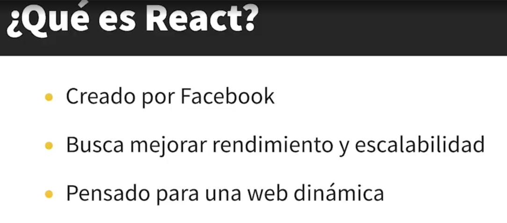

# UB_MUSIC
Repositorio dedicado a el proyecto de Construcción de Software

# Stack

# Integrantes

# Accesos

# Flujo de trabajar Github
📚 Guía de Trabajo con Git y GitHub
1. Clonación del Repositorio
Para comenzar a trabajar en el proyecto, el primer paso es clonar el repositorio a tu máquina local:

git clone https://github.com/RichardLoz/UB_MUSIC.git
Esto descargará una copia del repositorio en tu máquina.

2. Configuración Inicial
Una vez clonado el repositorio, navega a la carpeta del proyecto:

cd UB_Music
Configura tu nombre de usuario y correo electrónico para Git si no lo has hecho antes:

git config --global user.name "Tu Nombre"
git config --global user.email "tu.email@ejemplo.com"

3. Creación de una Rama de Trabajo
Cada miembro del equipo debe trabajar en su propia rama. Esto evita conflictos y facilita la colaboración.

Para el equipo de Frontend:
Cambiar a la rama frontend:
git checkout frontend

Crear una nueva rama a partir de frontend para la tarea específica:
git checkout -b feature/nombre-de-la-caracteristica

Para el equipo de Backend:
Cambiar a la rama backend:
git checkout backend

Crear una nueva rama a partir de backend para la tarea específica:
git checkout -b feature/nombre-de-la-caracteristica

4. Realizar Cambios y Cometerlos
Realiza los cambios en tu rama local y asegúrate de probar que todo funcione correctamente. Una vez satisfecho con los cambios, añade y comete tus cambios:
git add .
git commit -m "Descripción clara de los cambios realizados"

5. Subir los Cambios a GitHub (Push)
Una vez que hayas comiteado tus cambios, es hora de subirlos al repositorio remoto:
git push origin feature/nombre-de-la-caracteristica
Este comando subirá tu rama de trabajo a GitHub.

6. Crear un Pull Request (PR)
Después de subir los cambios, es necesario crear un Pull Request para fusionar tu rama en frontend o backend:
Ve a GitHub y abre el repositorio del proyecto.
Haz clic en "Compare & pull request" junto a la rama que acabas de subir.
Asegúrate de que el PR se dirija a la rama frontend o backend (según corresponda).
Proporciona una descripción clara de lo que hiciste y envía el PR.

7. Revisión del PR y Fusión
Una vez creado el PR, otro miembro del equipo debe revisarlo y aprobarlo. Si se aprueba, se fusionará en la rama correspondiente (frontend o backend).

Para fusionar:

Asegúrate de que el PR haya pasado las revisiones.
Haz clic en "Merge pull request" en GitHub.
Una vez fusionado, se eliminará la rama de características si ya no es necesaria.

8. Mantener tu Rama Sincronizada
Es importante mantener tu rama de trabajo actualizada con los últimos cambios de frontend o backend:
git checkout frontend   # o 'backend' según el equipo
git pull origin frontend  # o 'backend' según el equipo
git checkout feature/nombre-de-la-caracteristica
git merge frontend  # o 'backend' según el equipo
Resuelve cualquier conflicto que pueda surgir durante la fusión y continúa trabajando.

9. Finalización del Desarrollo
Una vez que las ramas frontend y backend estén completamente desarrolladas y probadas, se realizarán pruebas de integración en la rama testing. Si todo está bien, se fusionarán en la rama main para su despliegue.

Resumen de Comandos
Clonar el repositorio:

git clone https://github.com/tu-usuario/music-recommender.git
Cambiar a una rama existente:

git checkout frontend  # o backend
Crear una nueva rama de trabajo:

git checkout -b feature/nombre-de-la-caracteristica
Agregar y comitear cambios:

git add .
git commit -m "Descripción clara de los cambios realizados"
Subir la rama al repositorio remoto:

git push origin feature/nombre-de-la-caracteristica
Mantener tu rama sincronizada:

git pull origin frontend  # o backend
git merge frontend  # o backend

#FRONT

Instalar:
    - NodeJS: https://nodejs.org/en/download/package-manager
    - Creacion del proyecto:
        - npm create vite
        - cd 'nombre_proyecto'
        - npm install (instalar depenencias)
        - npm run dev (correr proyecto)

#Estructura del proyecto
    - assets/: Aquí almacenas recursos estáticos como imágenes, videos, audio y estilos globales.
    - images/: Imágenes estáticas.
    - videos/: Videos utilizados en la aplicación.
    - audio/: Archivos de audio.
    - styles/: Archivos CSS o SCSS globales.
    - components/: Componentes React reutilizables. Cada componente puede tener su propia carpeta si tiene estilos o lógica asociada.
    - hooks/: Hooks personalizados de React que encapsulan lógica reutilizable.
    - context/: Para manejar estados globales con Context API de React.
    - pages/: Componentes que representan páginas completas de la aplicación. Suelen contener otros componentes dentro.
    - services/: Para manejar la comunicación con APIs u otros servicios externos. Mantiene el código organizado y desacoplado.
    - utils/: Funciones utilitarias que no pertenecen a ningún componente específico y pueden ser reutilizadas en diferentes partes del proyecto.